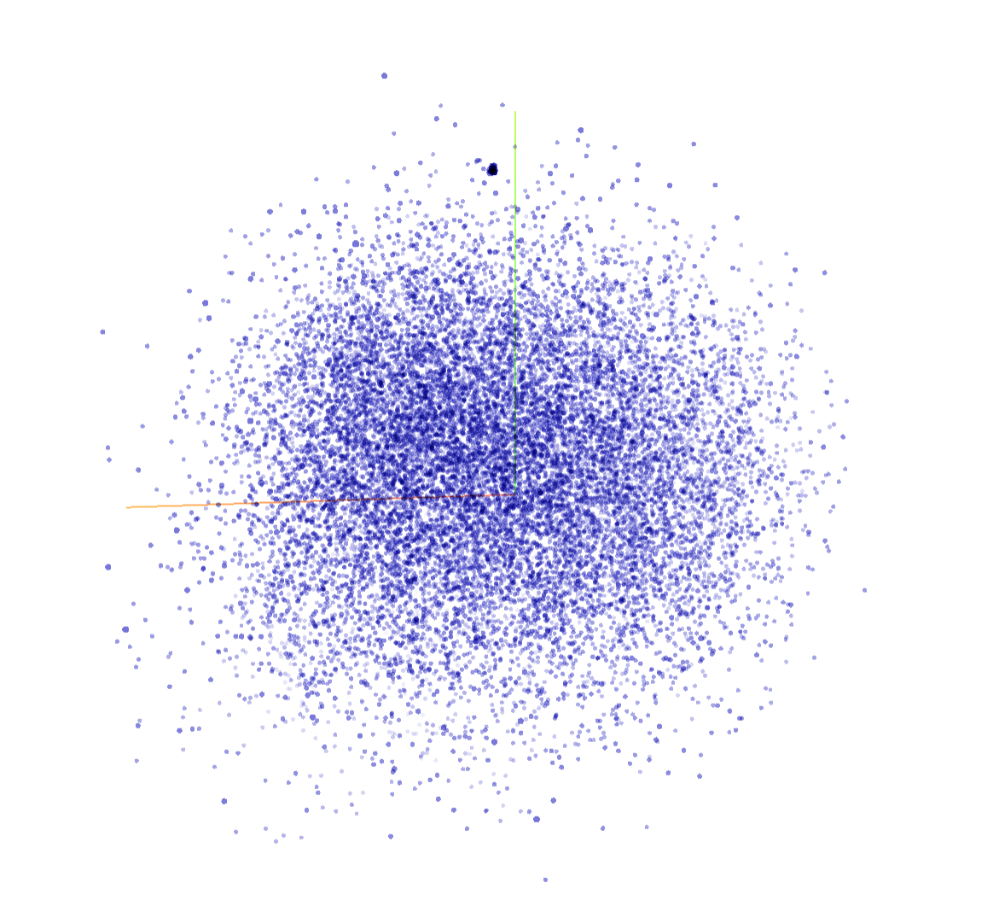

# Harry Potter Word2Vec Analysis ⚡

Este projeto utiliza técnicas de **Processamento de Linguagem Natural (NLP)** para analisar as relações semânticas nos livros da saga Harry Potter. Através do modelo **Word2Vec**, transformei o texto dos livros em vetores matemáticos para explorar a proximidade entre personagens, objetos e conceitos mágicos.

## 📂 Estrutura do Projeto

Para garantir o correto funcionamento do script, o projeto está organizado da seguinte forma:

```text
/
├── livros/               # Contém os 6 ficheiros .txt dos livros de Harry Potter
├── models/               # Pasta onde o modelo treinado (.model) é guardado
├── Project_models/       # Pasta com os ficheiros .tsv (Tensor e Metadata) para o Projector
├── harry_potter_nlp.py   # Script principal de processamento e treino
└── README.md             # Documentação do projeto
```

## 🚀 Funcionalidades
* **Pipeline de Limpeza:** Remove a pontuação, números e converte as palavras para minúsculas.
* **Lematização com spaCy:** Utilização do modelo `pt_core_news_sm` para reduzir palavras aos seus lemas, normalizando o vocabulário.
* **Extração de N-Grams:** Detecção automática de **Bigramas** (ex: `harry_potter`) e **Trigramas** (ex: `plataforma_nove_meio`).
* **Análise Visual:** * Heatmaps para comparação direta de embeddings.
    * Gráficos de dispersão PCA para a visualização de clusters semânticos.
* **Exportação para TensorBoard:** Geração de ficheiros `.tsv` para visualização 3D interativa.

## 📊 Visualização Avançada

Além dos gráficos estáticos gerados em Python, este projeto permite a exploração interativa através do **TensorFlow Embedding Projector**.


*A imagem acima mostra o agrupamento tridimensional dos personagens principais e conceitos mágicos.*

## 🛠️ Decisões Técnicas e Aprendizados

### 1. Processamento de Texto (spaCy vs NLTK)
Embora o NLTK tenha sido considerado (conforme trechos comentados no código), optou-se pelo **spaCy** para a tokenização e lematização. O spaCy oferece um suporte superior para a língua portuguesa, permitindo filtrar *stopwords* e realizar lematização precisa num único passo, o que resultou num vocabulário muito mais limpo.

### 2. Hierarquia de N-Grams
Para evitar que o modelo tratasse "Harry" e "Potter" como entidades separadas, implementou-se uma passagem dupla de frases:
* **Threshold baixo (5):** Definido para ser agressivo na união de nomes próprios.
* **Resultado:** O modelo prioriza conceitos únicos (`harry_potter`, `vassoura_firebolt`), o que torna as análises de similaridade muito mais ricas.

### 3. Hiperparâmetros do Modelo
* **`sg=1` (Skip-Gram):** Escolhido em detrimento do CBOW por apresentar melhores resultados em datasets com nomes próprios (palavras raras).
* **`vector_size=150`:** Escolhi 150 para tentar evitar o *overfitting*, garantindo que o modelo aprenda generalizações e não apenas decore o texto.
* **`epochs=100`:** O aumento do número de épocas permitiu que os vetores estabilizassem, corrigindo problemas iniciais de dispersão exagerada no PCA.

## 📈 Resultados e Testes
O projeto está estruturado em 4 fases de análise:
1. **Most Similar:** Identificação dos vizinhos mais próximos de termos chave.
2. **Similaridade Direta:** Cálculo do cosseno entre vetores (ex: Harry vs Voldemort).
3. **Analogias:** Testes de lógica vetorial (ex: `A` está para `B` como `C` está para `X`).
4. **Deteção de Anomalias:** Uso do método `doesnt_match` para encontrar o "intruso" num grupo.

## 🛠️ Como Instalar e Correr
1. **Instalar Dependências:**
   ```bash
   pip install gensim spacy seaborn pandas matplotlib scikit-learn nltk
   python -m spacy download pt_core_news_sm